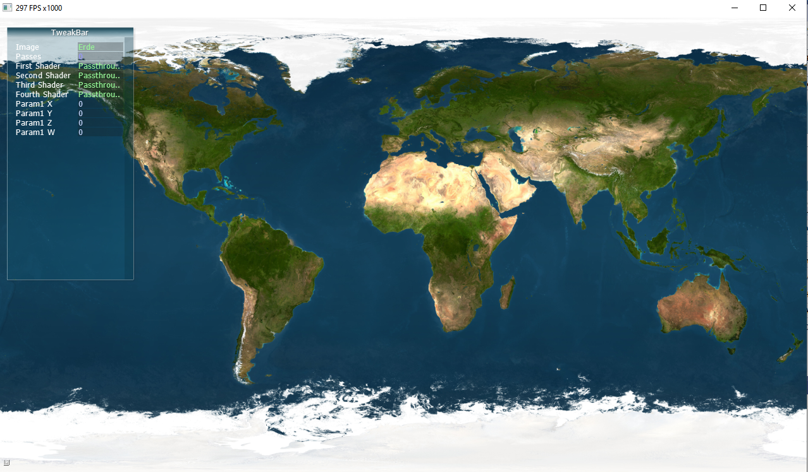

# Praktikum1

## Aufgabe1

*Orginal*

*Bew Mit Filter*

Bei dem Filter "Bew Mit" Filter wird der Durchschnittsfarbwert von einem Pixel und die acht Nachbarn gebildet, dabei wird im bild eine leichte Unschärfe erzeugt.

## Aufgbabe2

1. Brightness_Contrast: param1.x -> helligkeit param.y -> Kontrast
   
2. Gauss3x3: param.x -> Faktor
   
3. Gauss5x5:  param.x -> Faktor
   
4. Gauss7x7:  param.x -> Faktor  ??? Messen der Berechnungen
   
5. Laplace:
   
6. Sobel:
   
7. Sharben:
   
8. Dilation:
   
9. Erosion:

## Aufgabe3