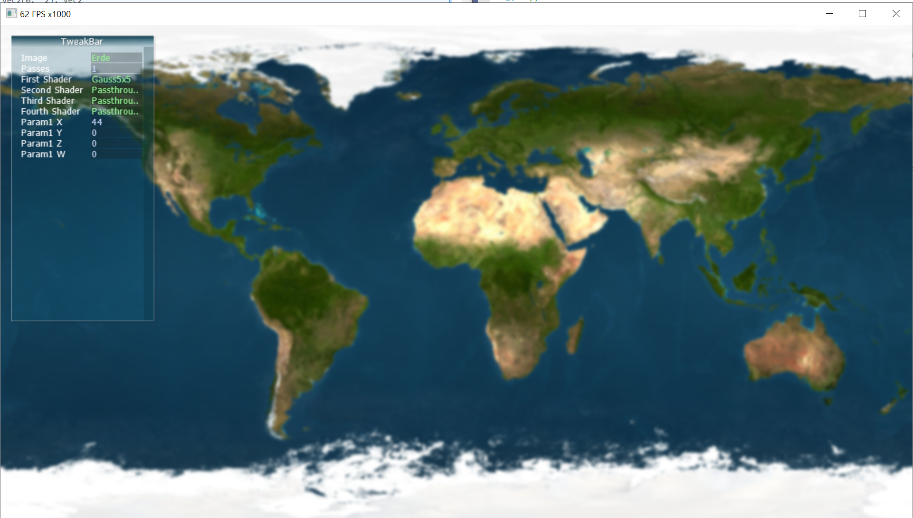

# Praktikum1
## David Haupenthal und Nicole Gertz

## Aufgabe1

*Passthroughfilter*

Gibt das Bild unverändert aus.

*Bew Mit Filter*

Bei dem Filter "Bew Mit" wird der Durchschnittsfarbwert von einem Pixel und die acht Nachbarn gebildet, dabei wird das Bild geglättet.

## Aufgabe2

1. Brightness_Contrast: 
* param1.x -> Helligkeit: Summe von Pixel und Inputparameter. Bei negativen Werten werden alle Farb- oder Grauwerte gleichmäßig dunkler dargestellt und bei positven Werte heller.
* param1.y -> Kontrast: Der Pixel wird mit dem Inputparameter multipliziert. Nur positive Werte. Kontrast steigt. 

Filter ändert Kontrast und Helligkeit. 

*Brightness Contrast Filter: Helligkeit auf 4*

*Brightness Contrast Filter: Kontrast auf 3*
   
2. Gauss3x3: 
* param1.x -> Glättungs-Faktor nur postive Werte

Glätttet die Kanten --> kleiner Stukturen gehen verloren, gröberer bleiben erhalten, vermeidet Bildrauschen

   
3. Gauss5x5:  
* param1.x -> Glättungs-Faktor nur postive Werte
* param1.y --> muss auf !=0 eingestellt sein

Glätttet die Kanten --> kleiner Stukturen gehen verloren, gröberer bleiben erhalten, vermeidet Bildrauschen. 

Die Filterfunktion Gauss5x5 und Guass7x7 unterscheiden sich grundsätzlich von Gauss3x3 nur darin, dass die verwendete Offset-Matrix und der Filterkern jeweils größer sind und damit der Effekt verstärkt wird. 

   
4. Gauss7x7: 

HX-Teil (Gauss7x7)
* param1.x -> Glättungs-Faktor nur postive Werte

HY-Teil (Gauss 5x5)
* param1.x -> Glättungs-Faktor nur postive Werte
* param1.y ->muss auf 0 eingestellt werden

Glätttet die Kanten --> kleiner Stukturen gehen verloren, gröberer bleiben erhalten, vermeidet Bildrauschen. Durch die speuielle Form des Filterkerns lässt sich die Funktion in x- und y-Richtung ausspelten. Den horizontalen und vertikalen Filter hintereinander angewendet ergibt dasselbe Ergebnis wie ein Durchlauf mit dem obigen Vorgehen, aber die Rechenzeit wird deutlich verbessert.

FpS haben sich halbiert. 49 (Multiplikation + Addition) --> 14 (Multiplikation + Addition)

   
5. Laplace:
* param1.x --> Heligkeit 
* param1.y --> Kontrast nur positive Werte

Kantenerkennung 2. diskrete Ableitung. Verstärkt auch das Rauschen eines Bildes.
Mittels der Laplace-Filtermaske werden Extrempunkte eines Bildes betrachtet. Nach Berechnung muss der Wertebereich anschleißend normalisiert werden.

*Laplace Filter mit param.x Faktor*

*Laplace Filter mit param.y Faktor*

6. Sobel:
* param1.x --> Heligkeit 
* param1.y --> Kontrast nur positive Werte

 1. Ableitung Kantenerkennung. Die Berechnungen werden in x- und y-Komponente aufgeteilt. Beide besitzen jeweils ihren eigenen Filterkern. Aus den komponenten wird der Betrag gebildet.

*Sobel Filter mit param.x Faktor*

*Sobel Filter mit param.y Faktor*
   
7. Sharpen:
* param1.x: Durch den Parameter wird die Intensität des Effektes gesteuert.

Konturen im Bild werden hervorgehoben. Das Bild wirkt schärfer.

*Sharpen Filter mit einem positiven param.x Faktor*

*Sharpen Filter mit einem negitiven param.x Faktor*
   
8. Dilatation:
* param1.x -> Einstellen der Distanz

Erweitert den Weißbereich, dunklere Bereiche werden überschrieben. Aus den umliegenden Nachbarn wird der höchste Wert von dem Bezugspunkt übernommen. Je nach Größe des verwendeten Ausschnitts des Bildes ist der Effekt stärker.

   
9. Erosion:
* param1.x -> Einstellen der Distanz

Erweiterung der dunklen Bereiche auf Kosten der Weißbereiche. Die umliegenden Nachbarn werden zum Betugspunkt betrachtet. Statt dem höchsten Wert wird bei der Erosion der kleinste Wert übernommen. Je mehr Nachbarn betrachtet werden, desto stärker ist der Effekt.

Können der Dilatation Filter und der Erosion Filter ebenfalls in einen horizontalen und vertikalen Anteil aufgespalten werden?

Dilatation und Erosion sind beide jeweils separierbar. Das strukturierende Element dieser Filter sind hier Matrizen nur mit 1er Einträgen. Somit eine symmetrische Matrix, welche sich aufteilen lässt in x- und y-Komponente.

## Aufgabe3

Der Laplace Filter wird zuerst verwendet, um ein kantenextrahiertes Bild zu liefern. Mit einer Helligkeit (Param1.x) von -5 ist das Bild dunkler geworden während der Kontrast (Param1.y) auf 3 macht die Schrift heller und ausgeprägter. Mit den zwei Verwendungen vom Bewegte-Mittwert-Filter wird das Rauschen im Hintergrund reduziert.

