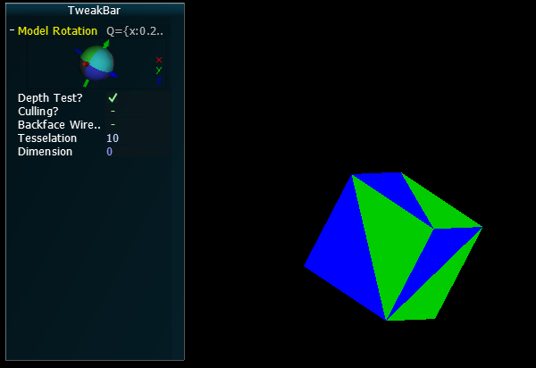
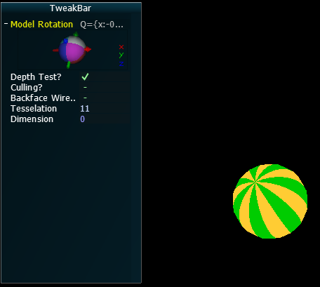
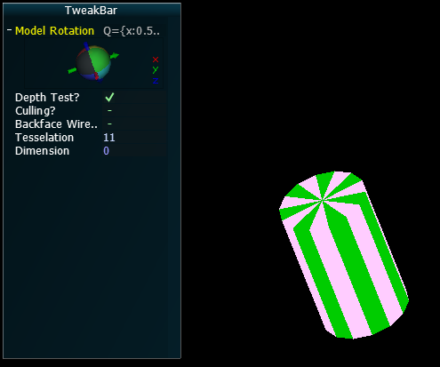
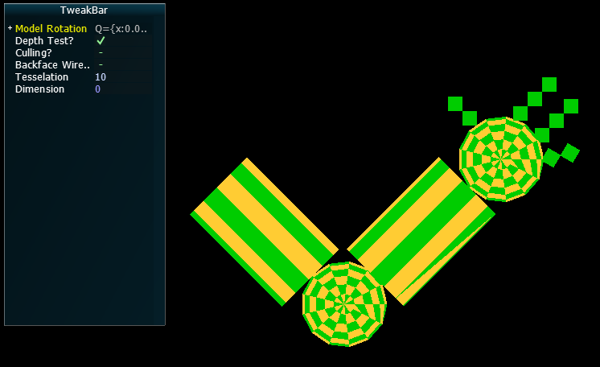
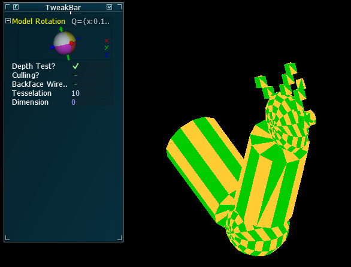

# Praktikum 3
## David Haupenthal und Nicole Gertz

## Aufgabe 3.1 d)

Die Funktion _void glFrontFace(GLenum mode)_ kontrolliert, welche Seite des Objekts die "vorder" Seite ist, indem es definiert, welche Seiten des Polygons vorne und hinter sind. Die zwei "Modes" sind _GL_CW_ für Clockwise oder Uhrzeigersinn und _GL_CCW_ für Counter-Clockwise oder Gegenuhrzeigersinn.

Die Funktion _glCullFace_ bestimmt, ob die Vorderseite bzw. die Rückseite entfernt (culled) werden darf. Dazu muss "Cull Face" aktiviert sein mit _glEnable(GL_CULL_FACE)_. 

Wenn das Programm weißt, welche Seite vorne ist, muss es nicht die Rückseite zeichnen, was der Zeichenvorgang enorm beschleunigt.

## Aufgabe 3.1 e)

_A1_Versuch1a_: Die Rendertechnik in diesem Versuch benutzt den "Immediate Mode", dass heißt, für jeden Vertex wird ein eigener Befehl aufgerufen und diese Daten werden unmittelbar an die Grafikkarte geschickt. Immediate Mode ist deswegen nicht effizient und steht nur im Rahmen des _Compatibility Profiles_ zur Verfügung.

_A1_Versuch1b_: Die Rendertechnik in diesem Versuch benutzt den effizientieren "Display List" Zeichenmodus, bei dem eine bestimmte Menge an vertex-bezogenen Daten auf der CPU zu größeren Paketen zusammengefasst werden und anschließend kompakt zur Grafikkarte geschickt werden. In diesen Paketen sind mehrere OpenGL-Befehle zusammengefasst und wird als Display List bezeichnet. Ein anderer Vorteil ist, dass man die OpenGL-Befehlpakete nur einmal während der Initialisierung an den Server schicken muss, wo sie gespeichert und anschließend beliebig oft wieder zum Zeichnen aufgerufen werden können. Dadurch muss man während der Laufzeit nicht andauernd und für jedes Frame erneut die gesamten Daten zum Zeichnen des Objektes von Client zum Server schicken. 

## Aufgabe 3.2 a) 

Alle Objekte sind aus _GL_TRIANGLE_STRIP_, dass heißt verbundene Dreiecken, gerendert. Verbundene Dreiecke sind die am häufigsten verwendete Grafik-Primitive in der Interaktiven 3D-Computergrafik, weil es das einfachste Grafik-Primitiv zum Zeichnen komplexer Oberflächen ist, die Grafik-Primitiv zum Zeichnen komplexer Oberflächen den meisten Speicher einspart (teil-planare) und alle Oberflächen durch einen Satz von Triangle-Strips beliebig genau approximiert werden können. In unserem Programm rechnen wir für jedes Objekt (Quadar, Kugel und Zylinder) wie viele Vertices gebraucht werden und wo sie sein sollen. Diese Berechnung hängt auch von der Anzahl der Tesselation ab. Die Anzahl der Tesselation und auch der Ausmaßen lässt sich über die GUI einstellen. 

# Quader

# Kugel

# Zylinder

## Aufgabe 3.2 b) Komplexe Szene

Um die komplexe Szene zu rendern sind alle 3 Objekte und die 3 Modell-Transformationen (Translate(), Rotate() und Scale()) benutzt. Die Objekte befinden sich dabei jeweils auf seperaten Hierarchieebenen. Diese Hierarchie wird im Code mit Hilfe der GLMatrixStack Klasse hergestellt. Diese Klasse speichert Matrizen indem sie durch Push- und Pop-Befehle auf einen Stack gelegt und von diesem heruntergenommen werden.

